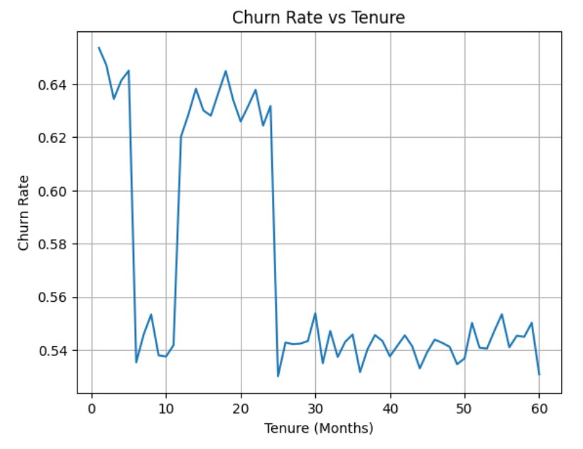

# Customer Churn Analysis

## 🎯 Objective
Analyze customer churn behavior and identify key factors leading to customer attrition.

---

## 📂 Dataset
Customer dataset containing:
- Tenure
- Support Calls
- Subscription Type
- Contract Length
- Total Spend
- Churn (Target Variable)

---

## 🧹 Data Cleaning
- Removed missing values
- Converted data types
- Removed duplicates
- Encoded categorical variables

---

## 📊 Exploratory Data Analysis

### 📈 Churn Rate vs Tenure

Churn is highest among customers with low tenure and stabilizes over time, indicating that early-stage customer retention is critical.

---

### 🔍 Key Insights
- Customers with **monthly contracts** have the highest churn
- Customers with **high support calls** show significantly higher churn
- **Early tenure customers** are more likely to leave
- **Subscription type** has minimal impact on churn
- Customers who churn tend to have **lower spending**

---

## 🤖 Model
- Logistic Regression
- Train-test split
- Feature encoding (get_dummies)
- Standard scaling

### 📈 Accuracy
- ~89.6%

---

## 💡 Business Recommendations
- Focus on **retaining early-stage customers**
- Improve **customer support experience**
- Encourage **long-term contracts**
- Identify and target **low-engagement customers**

---

## 🛠️ Tools Used
- Python
- Pandas
- NumPy
- Matplotlib
- Scikit-learn
